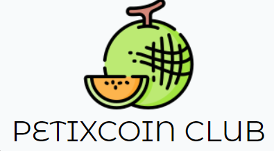

# PETIXCOIN CLUB (PETIX)
PetixCoin Club is a smart contract which is letting its users to mint PetixCoin Token and to become a member of PetixCoin Club by paying 10 PetixCoin.
The project is deployed on an EVM compatible network which is Fantom Testnet. The reason why Fantom Testnet is chosen for this project is its 
reliability, speed and convenience of obtaning Fantom test tokens. The project repo is in Github and project is deployed on internet by using Netlify services.
The project frontend is prepared with React.js and all components and style are coded individually.

The project is prepared for Patika Paribu Course program as final project. 

## GETTING STARTED

As the project has a frontend, you do not need to deploy any dependecy on your computer. Here are the easy steps to interact with PetixCoin:

<strong>1) </strong> Make sure you have Metamask on your browser. Preferably use Google Chrome.

<strong>2) </strong>If you do not have "Fantom Testnet" in your Metamask networks list, then follow these steps below. If you have, you can skip to step 3.

<strong>2.a) </strong>Open Metamask, find "Add Networks" button inside networks list and click on it.

<strong>2.b) </strong>Click on "Add Networks Manually" and then copy paste following settings below and then click on "save":

<strong>Network name:</strong> fantom testnet  
<strong>New RPC URL:</strong> https://rpc.testnet.fantom.network/  
<strong>Chain ID:</strong> 4002  
<strong>Currency symbol:</strong> FTM   

<strong>3) </strong>You will need Fantom Test tokens. Go to following website ( https://faucet.fantom.network/ ) and get some Fantom test tokens.

<strong>4) </strong>Now go to project website: https://petixcoin-patika.netlify.app/

<strong>5) </strong>General rule: between each button click try to wait for 4 seconds. Blockchain needs a few seconds to process your button clicks.

<strong>6) </strong>Click on "Connect Metamask". You will see PetixCoin contract address. Copy it, then go to your Metamask, click on "assets". 
Then click on "import tokens". Then paste PetixCoin contract address. Other information will be filled up automatically.

<strong>7) </strong>Now go the right side of the webpage, you will see "Mint PetixCoin" tokens. Enter "30" inside the input field, then click on it.

<strong>8) </strong>You can now become a member. Find "Become Member" button, then enter at least 10 as input and click on button. 

<strong>9) </strong>Once you become a member, you can discover other buttons as well.

## TECHNICAL ASPECTS:

<strong>Ethereum Token Standard:</strong> ERC20  
<strong>Frontend:</strong> React.js - a JavaScript library for building user interfaces.  
<strong>Contract Compilation and Deployment Platform:</strong> Hardhat  
<strong>Contract - Frontend Connection:</strong> Ethers.js  
<strong>Network:</strong> Fantom Testnet

## OTHER ASPECTS:

<strong>Author:</strong> Abdulhakim Altunkaya  
<strong>License:</strong> MIT, 2023  
<strong>Project created for:</strong> Patika Paribu Solidity Course, Final Project  